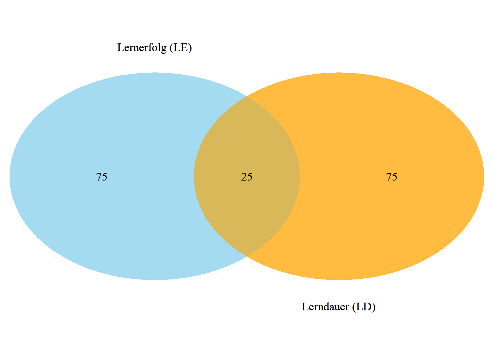

# Das einfache lineare Modell {-}


Formal wird ein einfaches lineares Regressionsmodell (***ELR***) definiert durch:

$$y_i = b_0 + b_1 \cdot x_i + \varepsilon_i$$

mit:

- $y_i$: Kriterium, abhängige Variable - also der beobachtete Wert des Kriteriums der $i$-ten Person.
- $b_0$: konstanter Term, intercept (Wert für $y_i$ wenn $x_i = 0$).
- $b_1$: Steigung, regression coefficient, gradient, slope
- $x_i$: Prädiktor, unabhängige Variable: also der beobachtete Wert des Prädiktors der $i$-ten Person.
- $\varepsilon_i$: Fehler, error term
- $i$: Index für betrachteten Fall

Eine sehr bedeutende Rolle in dieser Gleichung nehmen die sogenannten **Regressionskoeffizienten** $b_0$ und $b_1$ ein. Man nennt diese auch die **Parameter** (= bestimmenden Elemente) der Gleichung. Sind diese Werte bekannt, kann man für jedes beliebige $x_i \in \mathbb{R}$ einen entsprechenden $y_i$-Wert auf der Gerade bestimmen. Damit ist also durch diese Parameter die Lage und Steigung der Gerade eindeutig bestimmt!

Will man formal jene Werte beschreiben, die durch das Modell für einen bestimmten Prädiktorwert $x_i$ vorhergesagt werden, schreibt man:

$$\hat{y}_i = b_0 + b_1 \cdot x_i$$

Aus diesen beiden Darstellungsformen lässt sich eine wichtige Eigenschaft ableiten. Der beobachtete Wert des Kriteriums $y_i$ wird in den allermeisten Fällen nicht mit dem vom linearen Modell vorhergesagten Wert $\hat{y}_i$ übereinstimmen. Daher gilt:

$$\varepsilon_i = y_i - \hat{y}_i$$

Man bezeichnet das $\varepsilon_i$ auch als **Residuum**, oder **Fehler**, oder **Fehlerterm**. Das $\varepsilon_i$ ist also der Abstand von einem beobachteten Wert zu einem vom Modell vorhergesagten Wert an der Stelle $x_i$.

## Fehlerterm {-}

Über den Fehler $\varepsilon_i$ kann man auch die Modellannahme für die optimale Lage der Geraden innerhalb der beobachteten Wertepaare $(x_i, y_i)$ bestimmen. Eine simple und relativ leicht zu berechnende Annahme für den Fehlerterm lautet:

> Die Summe der quadratischen Abweichungen sollte ein Minimum sein!

$$\sum_{i=1}^{n} \varepsilon_{i}^2 = \sum_{i=1}^{n} (y_i - \hat{y}_i)^2 \rightarrow \text{Minimum}$$


Setzt man für $\hat{y}_i$ obige Gleichung ein, erhält man:

$$f(b_0,b_1) = \sum_{i=1}^{n} (y_i - b_0 - b_1 \cdot x_i)^2 \rightarrow \text{Minimum}$$
Durch partielle Ableitung und Null-setzen von $\frac{\partial f(b_0,b_1)}{\partial b_0} = 0$ und $\frac{\partial f(b_0,b_1)}{\partial b_1} = 0$ lassen sich die Koeffizienten bestimmen. 

> Diese Methode/Annahme ist unter den Namen **O**rdinary **L**east **S**quare, bzw. **MKQ** für **M**ethode der **K**leinsten **Q**uadrate bekannt.

Für das einfache lineare Modell ergibt sich für $b_0$:

$$b_0 = \bar{y} - b_1 \cdot \bar{x}$$

und für $b_1$:

$$b_1 = \frac{n \cdot \sum x_i \cdot y_i - \sum x_i \cdot \sum y_i}{n \cdot \sum x_i^2 - (\sum x_i)^2}$$

Um die Residuen und die Anpassung einer Geraden an die Daten besser zu verstehen, eignet sich folgende [**Visualisierung einer Regression**](https://phet.colorado.edu/sims/html/least-squares-regression/latest/least-squares-regression_en.html){target="_blank"} recht gut.

# Modellvorhersage \& Interpretation {-}

Das $b_0$ wird auch konstanter Term, oder Interzept genannt. Es ist jener $y$-Wert, der durch das Modell für die Stelle $x = 0$ vorhergesagt wird. Damit ist es auch jener Punkt auf der $y$-Achse, durch welche die Gerade geht. 

Inhaltlich entspricht dieser Wert dem vorhergesagtem Wert des Kriteriums $\hat{y}$ an dem der Prädiktor $x$ den Wert Null hat. Für unser Beispiel also jener Lernerfolg, der durch 0 Stunden Lernen zu erwarten wäre.

Die Steigung \textbf{$b_1$} gibt die erwartete Veränderung des Kriteriums $\hat{y}$ an, die einer Erhöhung des Prädiktors $x$ um einen Einheit entspricht.

## Beispiel {-}

Der Lernerfolg $\hat{y}$ soll durch die Anzahl der Stunden für die Vorbereitung zur Klausur $x$ vorhergesagt werden. Sei $b_0 = 10$ und $b_1 = 3$. Die Regressionsgleichung lautet daher:

$$\hat{y} = 10 + 3 \cdot x$$

Hat jemand $x = 0$ Stunden gelernt, wird anhand des Modells ein Lernerfolg von 10 vorhergesagt. Bei einem Lernaufwand von $x = 1$ Stunde, würde das Modell einen Lernerfolg von $\hat{y} = 13$, also eine um 3 Einheiten besseren Lernerfolg vorhersagen.

In vielen Fällen ist jedoch eine Vorhersage eines $\hat{y}$-Werte bei einem $x = 0$ nicht sinnvoll. Würde man z.B. den Lernerfolg mit Intelligenz vorhersagen und wären z.B. die aus beobachteten Daten ermittelten Koeffizienten $b_0 = -9$ und $b_1 = 0.2$, dann würde der Lernerfolg bei einer Intelligenz von $x = 0$ dem Wert $\hat{y} = -9$ vorhersagen. Das wäre aber offensichtlich eine unbrauchbare Vorhersage, da es einerseits keinen negativen Lernerfolg gibt und auf einer herkömmlichen IQ-Skala der Wert $x = 0$ auch keine Bedeutung hat.

## Korrelation/Regression {-}

Zusammenhang Korrelation und Regression:

$$b_1 = r(x,y) \cdot \frac{s_y}{s_x}$$

Daraus leiten sich folgende Erkenntnisse ab:

- Die Steigung ist positiv (negativ), wenn die Korrelation positiv (negativ) ist.
- Ist die Korrelation null, dann ist auch die Steigung null (Gerade ist parallel zur $x$-Achse)
- $b$ ist abhängig von $s_x$ und $s_y$. Daher führt eine Änderung der Messeinheit in einer der beiden Variablen auch zu einer Änderung der Steigung!
- Aus voriger Folgerung kann man erkennen, dass $b$ kein standardisiertes Maß für den Einfluß von $x$ auf $y$
- $b$ ist direkt proportional zu $r$

## Eigenschaften der Gerade {-}

Folgende Eigenschaften der Regressionsgeraden sind bemerkenswert:

- eine zur $x$-Achse parallele Gerade bedeutet, dass kein Zusammenhang zwischen den beiden Variablen besteht. Für jeden beliebigen Wert des Prädiktors $x$ wird stets der gleiche $y$-Wert (Kriterium) vorhergesagt.
- eine nach rechts oben steigend bedeutet, dass mit Zunahme der Werte des Prädiktors auch die Werte des Kriteriums steigen und damit eine Abhängigkeit der beiden Variablen gegeben ist (positiver Zusammenhang).
- eine nach rechts fallende bedeutet, dass mit Zunahme der Werte des Prädiktors die Werte des Kriteriums fallen und damit ebenfalls eine Abhängigkeit der beiden Variablen gegeben ist (negativer Zusammenhang).
- die Regressionsgerade wurde aus den Daten einer Stichprobe berechnet.
  - Die Parameter der Regressionsgerade $b_0, b_1, s_b$ sind Schätzwerte der in der Population vorhandenen Parameter $\beta_0, \beta_1, \sigma_b$.

## Beta-Gewichte {-}

Werden die in die Regression eingehenden Variablen (Kriterium und Prädiktorvariable(n)) vor Berechnung der Koeffizienten z-transformiert, erhält man standardisierte Koeffizienten. Diese Koeffizienten werden allegemein auch als **Beta-Gewichte** (**B_1**, oder $\beta_1$) bezeichnet. Es gilt:

$$\hat{z}_y = B_0 + B_1 \cdot z_x$$

Auch für das $B_1$ besteht ein direkt proportionaler Zusammenhang der Steigung zur Korrelation:

$$B_1 = r(z_x, z_y) \cdot \frac{s_{z_y}}{s_{z_x}} = r(x, y) \cdot \frac{1}{1} = r$$
Wie halten folgende wichtige Zusammenhänge zwischen $r(x,y)$ und $B_j$ fest:

- Die Korrelation $r(x,y)$ und der standardisierte Steigungskoeffizient $B$ sind identisch.[^1] 
- Beide Maße ($r(x,y)$ und $B$) sind unabhängig von der Messeinheit der beiden Variablen.
- $B$ und damit auch $r(x,y)$ zeigen den Effekt, den die Änderung des Prädiktors um eine Standardabweichung auf das z-transformierte Kriterium hat.
- $r$ ist somit eine Maßzahl, die bei Regressionsmodellen die Effektstärke widerspiegelt.
- Nach Cohen gelten folgende Richtwerte: $r = 0.1$ entspricht einem kleinen, $r = 0.3$ entspricht einem mittleren und $r = 0.5$ entspricht einem starken Effekt.
- der $\beta$-Koeffizient gibt an, wie viele Standardabweichungen sich die abhängige Variable ändert, wenn sich die unabhängige Variable um eine Standardabweichung ändert. Ein $\beta$-Wert von 0.5 bedeutet beispielsweise, dass eine Erhöhung der unabhängigen Variable um eine Standardabweichung zu einem Anstieg der abhängigen Variable um 0.5 Standardabweichungen führt.
- da die Koeffizienten standardisiert sind, kann das $\beta$ über verschiedene Modelle hinweg direkt verglichen werden, was hilfreich ist, wenn man wissen möchte, welcher Prädiktor den stärksten Einfluss hat (insbesondere in einer multiplen Regressionsanalyse).
- während der $\beta$-Koeffizient die Stärke und Richtung der Beziehung zwischen zwei Variablen beschreibt, impliziert er <ins>*keine Kausalität*</ins>.

[^1]: WICHTIG: dies gilt prinzipiell für ELR, aber unter der Bedingung, dass alle verwendeten Prädiktoren voneinander unabhängig sind (also nicht korrelieren) auch für die Beta-Gewichte der multiplen Regression!}

## Residuen {-}

Eigenschaften von Residuen:

- Die $\varepsilon_i$ enthalten Anteile der Kriteriumsvariablen $y$, die durch die Prädiktorvariable $x$ nicht erfasst/erklärt werden.
- Diese Anteile bestehen aus
  - Messfehler
  - Anteile, die evtl. durch weitere Variablen erklärt werden, die aber mit dem verwendeten Prädiktor nichts zu tun haben, also mit $r(x,\varepsilon) = 0$ korrelieren.

Für den sogenannten \textbf{Standardfehler der Residuen} gilt:

$$s_e = \sqrt{\frac{\sum_{i=1}^{n} e_i^2}{n-2}} = \sqrt{\frac{1}{n-2} \cdot \sum_{i=1}^{n} e_i^2}$$

## Standardschätzfehler {-}

Der **Standardschätzfehler*}** ($s_e$) (engl. standard error of estimate) bei einer Regression kennzeichnet die Streuung der $y$-Werte um die Regressionsgerade und ist damit ein Gütemaßstab für die Genauigkeit der Regressionsvorhersagen. Je kleiner dieser Fehler, desto besser die Regressionsvorhersage.

Dieser Fehler ist ein eigenes Modellgütemaß, wird aber weniger häufig als das Bestimmtheitsmaß, bzw. als Determinationskoeffizient angegeben, obwohl der Standardfehler der Residuen bei der Bewertung Anpassungsgüte möglicherweise aussagekräftiger ist (siehe Bemerkungen beim Bestimmtheitsmaß).

<ins>*Bemerkung:*</ins> Mithilfe des Standardfehlers können Konfidenzintervalle konstruiert werden.

## Determinationskoeffizient {-}

Das Bestimmtheitsmaß, auch als $R^2$ bekannt, quantifiziert, wie gut die unabhängigen Variablen in einem linearen Regressionsmodell die Streuung der abhängigen Variable erklären, indem es den Anteil der Gesamtvarianz darstellt, der durch das Modell erklärt wird\footnote{Wikipedia}. 

Es ist wichtig für die Bewertung der Modellanpassung, da ein höherer $R^2$-Wert auf eine bessere Erklärungsfähigkeit des Modells hinweist. Bei der Verwendung ist jedoch unbedingt auch auf die nachfolgend diskutierten Einschränkungen der (sinnvollen) Interpretierbarkeit diese Maßes zu achten!

$$R^2 = \frac{\sum_{i=1}^{n} (\hat{y}_i - \bar{y})^2}{\sum_{i=1}^{n} (y_i - \bar{y})^2} = 1- \frac{\sum_{i=1}^{n} (y_i - \hat{y}_i)^2}{\sum_{i=1}^{n} (y_i - \bar{y})^2}$$
in Worten:

$$R^2 = \frac{\textrm{erklärte Variation}}{\textrm{gesamte Variation}} = 1 - \frac{\textrm{unerklärte Variation}}{\textrm{gesamte Variation}}$$

**Wertebereich**: das Maß nimmt den Wert 1 an, wenn $\sum (y_i - \hat{y}_i)^2 = 0$, oder $\sum_{i=1}^{n} (\hat{y}_i - \bar{y})^2 = \sum_{i=1}^{n} (y_i - \bar{y})^2$ ist, bzw. den Wert 0, wenn $\sum_{i=1}^{n} (\hat{y}_i - \bar{y})^2 = 0$!

Wenn das Regressionsmodell kein Absolutglied enthält (es liegt ein homogenes Regressionsmodell vor), kann das Bestimmtheitsmaß negativ werden.[^2]

[^2]: Normalerweise wird $R^2$ in der Formel $R^2 = 1 - \frac{\text{SSR}}{\text{SST}}$ definiert, wobei SSR (Sum of Squared Residuals) der Teil der Varianz ist, der nicht durch das Modell erklärt wird, und SST (Total Sum of Squares) die Gesamtvarianz der abhängigen Variablen darstellt. In einem gewöhnlichen linearen Regressionsmodell, das ein Absolutglied (Intercept) beinhaltet, wird das Modell der optimalen Anpassung dadurch erreicht, dass es den Datenmittelwert als Ausgangspunkt nutzt. Dadurch hat SSR im besten Fall einen geringeren Wert als SST, was zu einem positiven $R^2$ führt. Bei einem homogenen Modell ohne Absolutglied, also ohne den konstanten Term, wird das Modell gezwungen, durch den Ursprung (Nullpunkt) zu verlaufen. Dies kann die Anpassung des Modells an die Daten stark verschlechtern, insbesondere wenn die tatsächlichen Datenpunkte um einen von Null verschiedenen Mittelwert gruppiert sind. In solchen Fällen kann die Summe der quadrierten Residuen (SSR) größer werden als die Gesamtvarianz (SST), was zu einem negativen Wert von $1 - \frac{\text{SSR}}{\text{SST}}$ führt. Ein negatives $R^2$ ist eine Indikation dafür, dass das Modell schlechter abschneidet als ein einfaches Durchschnittsmodell, das lediglich den Mittelwert der abhängigen Variablen als Vorhersage nutzt. 

## Venn Diagramm {-}

Cohen und Cohen (1975) und Kennedy (1981) konnten zeigen, dass sich das Bestimmtheitsmaß graphisch mittels Venn-Diagrammen veranschaulichen lässt.

Wir betrachten die Variablen Lernerfolg (`LE`) und Lerndauer (`LD`). Angenommen, ihre Korrelation beträgt $r = 0.5$. Daraus folgt der Determinationskoeffizient mit $r^2 = 0.5^2 = 0.25$, was 25% der Varianz erklärt. Mit anderen Worten: 25% der Varianz im Lernerfolg wird durch die Lerndauer erklärt.



Damit ergibt sich aber auch zwangsläufig die Erkenntnis, dass immerhin noch 75% der Variabilität vom Lernerfolg unerklärt sind! Man könnte also davon ausgehen, dass es weitere Variablen/Merkmale gibt, die weitere Anteile dieser noch unerklärten Varianz erklären können. Ideal wären dabei eine, oder mehrere Prädiktorvariablen, die mit der Kriteriumsvariablen hoch, mit den anderen unabhängigen Variablen aber wenig bis gar nicht korrelieren, wie im nachfolgenden Graph dargestellt wird:


Wie man den Angaben zur aufgeklärten Varianz entnehmen kann, beträgt die Korrelation von $r(LE,LD) = 0.50$, $r(LE,IQ) = 0.60$ und der $r(IQ,LD) = 0.08$. Daraus kann man sich ganz einfach die nicht aufgeklärte Varianz von `LE` errechnen. Diese ergbit sich aus $100 - 25 - 36 = 39$. 

## Multiple Regression {-}

Die Multiple lineare Regression ist ein statistisches Verfahren, mit dem versucht wird, eine beobachtete abhängige Variable durch mehrere unabhängige Variablen zu erklären. Die multiple lineare Regression stellt eine Verallgemeinerung der einfachen linearen Regression dar. Das Beiwort „linear“ bedeutet, dass die abhängige Variable als eine Linearkombination (nicht notwendigerweise) linearer Funktionen der unabhängigen Variablen modelliert wird (siehe Wikipedia). Dieser Themenbereich wird im Rahmen der Methodenlehre und Statistik 3 im Detail besprochen. 

Die Grundlegende Idee kann man jedoch bereits mit den gerade vorgestellten Venn-Diagrammen bereits gut erfassen. Für ein Modell mit 2 Prädiktoren eignet sich auch noch der Scatterplot gut, um die Eigenschaften und Zusammenhänge der Residuen und des Modells zu verstehen. Anstelle einer Linie, wird es bei 2 Prädiktoren einen Ebene. Ab 3 Prädiktoren ist der Scatterplot allerdings nicht mehr darstellbar.


```{=html}
<div class="plotly html-widget html-fill-item" id="htmlwidget-6e16c2883c26dd1edd48" style="width:672px;height:480px;"></div>
<script type="application/json" data-for="htmlwidget-6e16c2883c26dd1edd48">{"x":{"visdat":{"8cdc5d84304e":["function () ","plotlyVisDat"],"8cdc231b7527":["function () ","data"]},"cur_data":"8cdc231b7527","attrs":{"8cdc231b7527":{"alpha_stroke":1,"sizes":[10,100],"spans":[1,20],"x":{},"y":{},"z":{},"type":"scatter3d","mode":"markers","marker":{"size":3},"name":"Beobachtungen","inherit":true},"8cdc231b7527.1":{"alpha_stroke":1,"sizes":[10,100],"spans":[1,20],"z":[[89.210262676082721,91.178665777648902,93.147068879215084,95.115471980781265,97.083875082347447,99.052278183913629,101.02068128547981,102.98908438704599,104.95748748861217,106.92589059017835,108.89429369174454,110.8626967933107,112.83109989487689,114.79950299644307,116.76790609800925,118.73630919957543,120.70471230114161,122.67311540270779,124.64151850427398,126.60992160584016],[90.281636819998397,92.250039921564579,94.21844302313076,96.186846124696928,98.155249226263109,100.12365232782929,102.09205542939547,104.06045853096165,106.02886163252784,107.99726473409402,109.9656678356602,111.93407093722637,113.90247403879255,115.87087714035873,117.83928024192491,119.80768334349109,121.77608644505727,123.74448954662346,125.71289264818964,127.68129574975582],[91.353010963914073,93.321414065480241,95.289817167046436,97.258220268612604,99.226623370178785,101.19502647174497,103.16342957331115,105.13183267487733,107.10023577644351,109.06863887800969,111.03704197957587,113.00544508114204,114.97384818270822,116.94225128427441,118.91065438584059,120.87905748740677,122.84746058897295,124.81586369053913,126.78426679210531,128.75266989367151],[92.424385107829735,94.392788209395917,96.361191310962099,98.32959441252828,100.29799751409445,102.26640061566064,104.23480371722681,106.20320681879301,108.17160992035917,110.14001302192537,112.10841612349154,114.0768192250577,116.0452223266239,118.01362542819007,119.98202852975626,121.95043163132243,123.91883473288863,125.88723783445479,127.85564093602099,129.82404403758716],[93.495759251745412,95.464162353311593,97.432565454877775,99.400968556443956,101.36937165801012,103.33777475957632,105.30617786114249,107.27458096270868,109.24298406427485,111.21138716584105,113.17979026740721,115.14819336897338,117.11659647053958,119.08499957210574,121.05340267367194,123.02180577523811,124.9902088768043,126.95861197837047,128.92701507993667,130.89541818150283],[94.567133395661074,96.53553649722727,98.503939598793437,100.47234270035962,102.4407458019258,104.40914890349198,106.37755200505816,108.34595510662434,110.31435820819053,112.28276130975671,114.25116441132289,116.21956751288906,118.18797061445524,120.15637371602142,122.1247768175876,124.09317991915378,126.06158302071997,128.02998612228615,129.99838922385231,131.96679232541851],[95.63850753957675,97.606910641142932,99.575313742709113,101.54371684427528,103.51211994584148,105.48052304740764,107.44892614897384,109.41732925054001,111.3857323521062,113.35413545367237,115.32253855523857,117.29094165680473,119.2593447583709,121.2277478599371,123.19615096150326,125.16455406306946,127.13295716463563,129.10136026620182,131.06976336776799,133.03816646933419],[96.709881683492426,98.678284785058608,100.64668788662479,102.61509098819096,104.58349408975715,106.55189719132332,108.52030029288952,110.48870339445568,112.45710649602188,114.42550959758805,116.39391269915424,118.36231580072041,120.33071890228658,122.29912200385277,124.26752510541894,126.23592820698514,128.2043313085513,130.1727344101175,132.14113751168367,134.10954061324986],[97.781255827408103,99.74965892897427,101.71806203054047,103.68646513210663,105.65486823367281,107.623271335239,109.59167443680518,111.56007753837136,113.52848063993754,115.49688374150372,117.4652868430699,119.43368994463607,121.40209304620225,123.37049614776843,125.33889924933462,127.3073023509008,129.27570545246698,131.24410855403318,133.21251165559934,135.18091475716551],[98.852629971323779,100.82103307288995,102.78943617445614,104.75783927602231,106.72624237758849,108.69464547915467,110.66304858072085,112.63145168228704,114.59985478385322,116.5682578854194,118.53666098698558,120.50506408855175,122.47346719011793,124.44187029168411,126.41027339325029,128.37867649481649,130.34707959638266,132.31548269794882,134.28388579951502,136.25228890108122],[99.924004115239441,101.89240721680562,103.8608103183718,105.82921341993799,107.79761652150415,109.76601962307035,111.73442272463652,113.70282582620271,115.67122892776888,117.63963202933508,119.60803513090124,121.57643823246741,123.54484133403361,125.51324443559977,127.48164753716597,129.45005063873214,131.41845374029833,133.3868568418645,135.3552599434307,137.32366304499686],[100.9953782591551,102.9637813607213,104.93218446228747,106.90058756385365,108.86899066541983,110.83739376698601,112.80579686855219,114.77419997011837,116.74260307168456,118.71100617325074,120.67940927481692,122.64781237638309,124.61621547794927,126.58461857951545,128.55302168108165,130.52142478264781,132.48982788421398,134.45823098578018,136.42663408734637,138.39503718891254],[102.06675240307078,104.03515550463698,106.00355860620314,107.97196170776932,109.94036480933551,111.90876791090169,113.87717101246787,115.84557411403405,117.81397721560023,119.78238031716641,121.7507834187326,123.71918652029876,125.68758962186494,127.65599272343113,129.62439582499729,131.59279892656349,133.56120202812969,135.52960512969585,137.49800823126202,139.46641133282822],[103.13812654698646,105.10652964855264,107.07493275011882,109.04333585168499,111.01173895325118,112.98014205481735,114.94854515638355,116.91694825794971,118.88535135951591,120.85375446108208,122.82215756264827,124.79056066421444,126.75896376578061,128.7273668673468,130.69576996891297,132.66417307047917,134.63257617204533,136.60097927361153,138.5693823751777,140.53778547674389],[104.20950069090213,106.1779037924683,108.1463068940345,110.11470999560066,112.08311309716684,114.05151619873303,116.01991930029921,117.98832240186539,119.95672550343157,121.92512860499775,123.89353170656393,125.8619348081301,127.83033790969628,129.79874101126245,131.76714411282865,133.73554721439484,135.70395031596101,137.67235341752718,139.64075651909337,141.60915962065957],[105.28087483481781,107.24927793638398,109.21768103795017,111.18608413951634,113.15448724108252,115.1228903426487,117.09129344421488,119.05969654578107,121.02809964734725,122.99650274891343,124.96490585047961,126.93330895204578,128.90171205361196,130.87011515517815,132.83851825674432,134.80692135831049,136.77532445987669,138.74372756144288,140.71213066300905,142.68053376457522],[106.35224897873347,108.32065208029965,110.28905518186583,112.25745828343202,114.22586138499818,116.19426448656438,118.16266758813055,120.13107068969674,122.09947379126291,124.0678768928291,126.03627999439527,128.00468309596144,129.97308619752764,131.9414892990938,133.90989240066,135.87829550222617,137.84669860379236,139.81510170535853,141.78350480692473,143.75190790849089],[107.42362312264913,109.39202622421533,111.3604293257815,113.32883242734768,115.29723552891386,117.26563863048004,119.23404173204622,121.2024448336124,123.17084793517859,125.13925103674477,127.10765413831095,129.07605723987712,131.04446034144331,133.01286344300948,134.98126654457565,136.94966964614184,138.91807274770804,140.88647584927421,142.85487895084037,144.82328205240657],[108.49499726656481,110.463400368131,112.43180346969717,114.40020657126335,116.36860967282954,118.33701277439572,120.3054158759619,122.27381897752808,124.24222207909426,126.21062518066044,128.17902828222662,130.14743138379279,132.11583448535896,134.08423758692516,136.05264068849135,138.02104379005752,139.98944689162369,141.95784999318988,143.92625309475608,145.89465619632225],[109.56637141048049,111.53477451204667,113.50317761361285,115.47158071517902,117.43998381674521,119.40838691831138,121.37679001987757,123.34519312144374,125.31359622300994,127.28199932457611,129.2504024261423,131.21880552770847,133.18720862927464,135.15561173084083,137.124014832407,139.09241793397319,141.06082103553936,143.02922413710556,144.99762723867173,146.96603034023792]],"type":"surface","x":[0.024990933015942574,2.1168751504860426,4.2087593679561426,6.3006435854262426,8.3925278028963426,10.484412020366442,12.576296237836543,14.668180455306643,16.760064672776743,18.851948890246842,20.943833107716941,23.035717325187044,25.127601542657143,27.219485760127242,29.311369977597344,31.403254195067444,33.495138412537543,35.587022630007645,37.678906847477741,39.770791064947844],"y":[85.575691150734201,88.398562597576529,91.221434044418857,94.044305491261184,96.867176938103512,99.69004838494584,102.51291983178817,105.3357912786305,108.15866272547282,110.98153417231515,113.80440561915748,116.62727706599981,119.45014851284213,122.27301995968446,125.09589140652679,127.91876285336912,130.74163430021144,133.56450574705377,136.3873771938961,139.21024864073843],"opacity":0.5,"name":"Regressionsebene","inherit":true}},"layout":{"margin":{"b":40,"l":60,"t":25,"r":10},"scene":{"xaxis":{"title":"Lerndauer (LD)"},"yaxis":{"title":"Intelligenz (IQ)"},"zaxis":{"title":"Lernerfolg (LE)"}},"hovermode":"closest","showlegend":false,"legend":{"yanchor":"top","y":0.5}},"source":"A","config":{"modeBarButtonsToAdd":["hoverclosest","hovercompare"],"showSendToCloud":false},"data":[{"x":[11.50310080498457,31.532205417752266,16.359076872467995,35.320696160197258,37.618691371753812,1.8222599755972624,21.12421952188015,35.696761775761843,22.057400578632951,18.264589412137866,38.273333813995123,18.13336624763906,27.102825418114662,22.905336078256369,4.116987306624651,35.992998816072941,9.8435093741863966,1.6823813412338495,13.116828771308064,38.180145965889096,35.581572642549872,27.712136246263981,25.620272550731897,39.770791064947844,26.228231964632869,28.341218726709485,21.762640988454223,23.765680817887187,11.566389491781592,5.8845458924770355,38.520969301462173,36.091961804777384,27.628211136907339,31.818696707487106,0.98454738035798073,19.111838843673468,30.338381500914693,8.6563174333423376,12.727240305393934,9.2650314141064882,5.7120008952915668,16.581853432580829,16.548973051831126,14.753818036988378,6.0977899096906185,5.5522425379604101,9.3213639780879021,18.638498010113835,10.638905614614487,34.313108613714576,1.8332466669380665,17.688002968207002,31.956993825733662,4.8759703990072012,22.437919350340962,8.2612555846571922,5.1012660097330809,30.132314572110772,35.801814366132021,14.978511035442352,26.604607785120606,3.7936264369636774,15.358785511925817,10.975345782935619,32.58560155518353,17.940653655678034,32.402574121952057,32.495580380782485,31.773692844435573,17.593267504125834,30.179006345570087,25.168845262378454,28.407296054065228,0.024990933015942574,19.012662963941693,8.8047554064542055,15.192661508917809,24.510840130969882,14.071916369721293,4.4454169739037752,9.7447789087891579,26.722223497927189,16.705871187150478,31.527833361178637,4.1145857702940702,17.395709659904242,39.398279199376702,35.722044575959444,35.458762431517243,7.0021060109138489,5.227827662602067,26.124077001586556,13.740658890455961,26.270325118675828,12.814929699525237,7.5076447706669569,31.291772052645683,3.7437994685024023,18.671161662787199,20.460218396037817],"y":[117.99939275952056,103.30529471742921,111.87371685169637,137.4960605124943,111.55963184428401,133.96926221670583,135.29410028015263,118.48042402765714,107.58793770917691,93.090208001667634,136.44148917985149,101.56758949859068,88.339631435228512,137.12498170207255,124.63279503863305,92.826186257880181,115.21065608365461,137.47501812060364,117.20158442156389,107.24806549609639,120.63414136297069,102.59013394010253,101.92460059770383,97.08721971954219,105.32188762095757,139.13205619086511,93.481126545229927,90.007419993635267,92.804879928007722,122.95039058313705,119.059106586501,134.02667644317262,122.01495009358041,125.53927558590658,113.66246491787024,121.29111473215744,130.19930030801333,128.2454853435047,138.89020545524545,109.16873449343257,102.14362111408263,107.52112239366397,85.575691150734201,95.111723820446059,131.35011253878474,97.713898012880236,98.150497560855001,89.218014093348756,98.514802291756496,125.26743630412966,131.60992408054881,112.36399968969636,106.33499664138071,98.554694678168744,91.110305371694267,106.44969393848442,116.45644226926379,96.929101954447106,109.46224011131562,96.989486779784784,112.62647597934119,104.4647514517419,120.7491837348789,105.6092676136177,104.54949594335631,114.3528370000422,125.71838982170448,97.160661580273882,107.70103652379476,99.612767776707187,119.64851794065908,95.110566993243992,132.50042612897232,126.06124022742733,121.75565573503263,118.99098302936181,105.47309331246652,114.14096272201277,133.10752885765396,116.99625548790209,131.18722706334665,102.18464907025918,123.95596772199497,99.575979334767908,117.68887567217462,111.47093902691267,99.576800230424851,116.05247391271405,135.22535226657055,134.60309142246842,100.07916418253444,102.68155160243623,139.21024864073843,119.0996320603881,136.55227490351535,110.65929862787016,107.37579262931831,121.25766783137806,93.379063926404342,116.5076882019639],"z":[114.79909251566018,119.36422755685922,115.25768084010959,142.16987744185596,122.14299514055064,124.46447491544811,131.34345760976154,122.44496802430024,114.4391240843015,108.89042335254011,141.76897451985164,113.20381738395817,97.299741172271467,137.16234540295628,121.89848620007277,114.48059659938617,116.09759491639615,123.87017331351259,114.35100175058085,119.04307487718745,132.82291826085506,110.93178881027976,111.70456947525528,116.56598837516222,126.05874734314777,138.30329918848304,107.49504193731235,105.27783865230684,95.937327524845557,118.65100592381646,139.82461355339854,144.12217467800559,129.43073524392466,131.67435710218004,99.789763024985575,130.11638580141781,129.00550061144259,127.79973601151113,143.1322818174562,103.83116404759704,107.86545690437718,112.24472494484286,90.316749535702058,96.381777423897674,116.98629286412167,98.521317267144852,96.057252356662957,105.21144273528019,114.78035911416515,128.40860733957214,126.98226442722908,121.3440124718955,122.07400745658391,96.384388432836687,104.39891040220317,107.24343687341646,116.88509025945359,111.05433487364921,129.40934219441505,103.50899197473545,127.4043944059958,99.776254201370847,115.90304514658757,125.61935989571222,117.39315999713902,120.50845068557213,137.3870083063384,111.84135016803924,123.86188221044216,110.37039383268338,127.76656319303792,109.4882846940866,136.78361004862091,128.89762312078801,121.02861001512954,112.21608448840705,111.61643806904085,123.70649771810957,132.39384577976932,111.82826066492783,121.38681772888128,121.20629197859247,123.37386105920395,111.13953790165998,113.25810801096378,115.74163267704823,124.95250120955394,129.52144048786553,146.15739672828062,125.22675691532352,103.74155530698314,113.31569506504447,134.79042113461273,122.02808821172188,125.4400496155835,121.20139834858242,123.81248498520775,110.49591040809112,101.64509599647454,115.85809051640709],"type":"scatter3d","mode":"markers","marker":{"color":"rgba(31,119,180,1)","size":3,"line":{"color":"rgba(31,119,180,1)"}},"name":"Beobachtungen","error_y":{"color":"rgba(31,119,180,1)"},"error_x":{"color":"rgba(31,119,180,1)"},"line":{"color":"rgba(31,119,180,1)"},"frame":null},{"colorbar":{"title":"LE","ticklen":2,"len":0.5,"lenmode":"fraction","y":1,"yanchor":"top"},"colorscale":[["0","rgba(68,1,84,1)"],["0.0416666666666666","rgba(70,19,97,1)"],["0.0833333333333334","rgba(72,32,111,1)"],["0.125","rgba(71,45,122,1)"],["0.166666666666667","rgba(68,58,128,1)"],["0.208333333333333","rgba(64,70,135,1)"],["0.25","rgba(60,82,138,1)"],["0.291666666666667","rgba(56,93,140,1)"],["0.333333333333333","rgba(49,104,142,1)"],["0.375","rgba(46,114,142,1)"],["0.416666666666667","rgba(42,123,142,1)"],["0.458333333333333","rgba(38,133,141,1)"],["0.5","rgba(37,144,140,1)"],["0.541666666666667","rgba(33,154,138,1)"],["0.583333333333333","rgba(39,164,133,1)"],["0.625","rgba(47,174,127,1)"],["0.666666666666667","rgba(53,183,121,1)"],["0.708333333333333","rgba(79,191,110,1)"],["0.75","rgba(98,199,98,1)"],["0.791666666666667","rgba(119,207,85,1)"],["0.833333333333334","rgba(147,214,70,1)"],["0.875","rgba(172,220,52,1)"],["0.916666666666667","rgba(199,225,42,1)"],["0.958333333333333","rgba(226,228,40,1)"],["1","rgba(253,231,37,1)"]],"showscale":true,"z":[[89.210262676082721,91.178665777648902,93.147068879215084,95.115471980781265,97.083875082347447,99.052278183913629,101.02068128547981,102.98908438704599,104.95748748861217,106.92589059017835,108.89429369174454,110.8626967933107,112.83109989487689,114.79950299644307,116.76790609800925,118.73630919957543,120.70471230114161,122.67311540270779,124.64151850427398,126.60992160584016],[90.281636819998397,92.250039921564579,94.21844302313076,96.186846124696928,98.155249226263109,100.12365232782929,102.09205542939547,104.06045853096165,106.02886163252784,107.99726473409402,109.9656678356602,111.93407093722637,113.90247403879255,115.87087714035873,117.83928024192491,119.80768334349109,121.77608644505727,123.74448954662346,125.71289264818964,127.68129574975582],[91.353010963914073,93.321414065480241,95.289817167046436,97.258220268612604,99.226623370178785,101.19502647174497,103.16342957331115,105.13183267487733,107.10023577644351,109.06863887800969,111.03704197957587,113.00544508114204,114.97384818270822,116.94225128427441,118.91065438584059,120.87905748740677,122.84746058897295,124.81586369053913,126.78426679210531,128.75266989367151],[92.424385107829735,94.392788209395917,96.361191310962099,98.32959441252828,100.29799751409445,102.26640061566064,104.23480371722681,106.20320681879301,108.17160992035917,110.14001302192537,112.10841612349154,114.0768192250577,116.0452223266239,118.01362542819007,119.98202852975626,121.95043163132243,123.91883473288863,125.88723783445479,127.85564093602099,129.82404403758716],[93.495759251745412,95.464162353311593,97.432565454877775,99.400968556443956,101.36937165801012,103.33777475957632,105.30617786114249,107.27458096270868,109.24298406427485,111.21138716584105,113.17979026740721,115.14819336897338,117.11659647053958,119.08499957210574,121.05340267367194,123.02180577523811,124.9902088768043,126.95861197837047,128.92701507993667,130.89541818150283],[94.567133395661074,96.53553649722727,98.503939598793437,100.47234270035962,102.4407458019258,104.40914890349198,106.37755200505816,108.34595510662434,110.31435820819053,112.28276130975671,114.25116441132289,116.21956751288906,118.18797061445524,120.15637371602142,122.1247768175876,124.09317991915378,126.06158302071997,128.02998612228615,129.99838922385231,131.96679232541851],[95.63850753957675,97.606910641142932,99.575313742709113,101.54371684427528,103.51211994584148,105.48052304740764,107.44892614897384,109.41732925054001,111.3857323521062,113.35413545367237,115.32253855523857,117.29094165680473,119.2593447583709,121.2277478599371,123.19615096150326,125.16455406306946,127.13295716463563,129.10136026620182,131.06976336776799,133.03816646933419],[96.709881683492426,98.678284785058608,100.64668788662479,102.61509098819096,104.58349408975715,106.55189719132332,108.52030029288952,110.48870339445568,112.45710649602188,114.42550959758805,116.39391269915424,118.36231580072041,120.33071890228658,122.29912200385277,124.26752510541894,126.23592820698514,128.2043313085513,130.1727344101175,132.14113751168367,134.10954061324986],[97.781255827408103,99.74965892897427,101.71806203054047,103.68646513210663,105.65486823367281,107.623271335239,109.59167443680518,111.56007753837136,113.52848063993754,115.49688374150372,117.4652868430699,119.43368994463607,121.40209304620225,123.37049614776843,125.33889924933462,127.3073023509008,129.27570545246698,131.24410855403318,133.21251165559934,135.18091475716551],[98.852629971323779,100.82103307288995,102.78943617445614,104.75783927602231,106.72624237758849,108.69464547915467,110.66304858072085,112.63145168228704,114.59985478385322,116.5682578854194,118.53666098698558,120.50506408855175,122.47346719011793,124.44187029168411,126.41027339325029,128.37867649481649,130.34707959638266,132.31548269794882,134.28388579951502,136.25228890108122],[99.924004115239441,101.89240721680562,103.8608103183718,105.82921341993799,107.79761652150415,109.76601962307035,111.73442272463652,113.70282582620271,115.67122892776888,117.63963202933508,119.60803513090124,121.57643823246741,123.54484133403361,125.51324443559977,127.48164753716597,129.45005063873214,131.41845374029833,133.3868568418645,135.3552599434307,137.32366304499686],[100.9953782591551,102.9637813607213,104.93218446228747,106.90058756385365,108.86899066541983,110.83739376698601,112.80579686855219,114.77419997011837,116.74260307168456,118.71100617325074,120.67940927481692,122.64781237638309,124.61621547794927,126.58461857951545,128.55302168108165,130.52142478264781,132.48982788421398,134.45823098578018,136.42663408734637,138.39503718891254],[102.06675240307078,104.03515550463698,106.00355860620314,107.97196170776932,109.94036480933551,111.90876791090169,113.87717101246787,115.84557411403405,117.81397721560023,119.78238031716641,121.7507834187326,123.71918652029876,125.68758962186494,127.65599272343113,129.62439582499729,131.59279892656349,133.56120202812969,135.52960512969585,137.49800823126202,139.46641133282822],[103.13812654698646,105.10652964855264,107.07493275011882,109.04333585168499,111.01173895325118,112.98014205481735,114.94854515638355,116.91694825794971,118.88535135951591,120.85375446108208,122.82215756264827,124.79056066421444,126.75896376578061,128.7273668673468,130.69576996891297,132.66417307047917,134.63257617204533,136.60097927361153,138.5693823751777,140.53778547674389],[104.20950069090213,106.1779037924683,108.1463068940345,110.11470999560066,112.08311309716684,114.05151619873303,116.01991930029921,117.98832240186539,119.95672550343157,121.92512860499775,123.89353170656393,125.8619348081301,127.83033790969628,129.79874101126245,131.76714411282865,133.73554721439484,135.70395031596101,137.67235341752718,139.64075651909337,141.60915962065957],[105.28087483481781,107.24927793638398,109.21768103795017,111.18608413951634,113.15448724108252,115.1228903426487,117.09129344421488,119.05969654578107,121.02809964734725,122.99650274891343,124.96490585047961,126.93330895204578,128.90171205361196,130.87011515517815,132.83851825674432,134.80692135831049,136.77532445987669,138.74372756144288,140.71213066300905,142.68053376457522],[106.35224897873347,108.32065208029965,110.28905518186583,112.25745828343202,114.22586138499818,116.19426448656438,118.16266758813055,120.13107068969674,122.09947379126291,124.0678768928291,126.03627999439527,128.00468309596144,129.97308619752764,131.9414892990938,133.90989240066,135.87829550222617,137.84669860379236,139.81510170535853,141.78350480692473,143.75190790849089],[107.42362312264913,109.39202622421533,111.3604293257815,113.32883242734768,115.29723552891386,117.26563863048004,119.23404173204622,121.2024448336124,123.17084793517859,125.13925103674477,127.10765413831095,129.07605723987712,131.04446034144331,133.01286344300948,134.98126654457565,136.94966964614184,138.91807274770804,140.88647584927421,142.85487895084037,144.82328205240657],[108.49499726656481,110.463400368131,112.43180346969717,114.40020657126335,116.36860967282954,118.33701277439572,120.3054158759619,122.27381897752808,124.24222207909426,126.21062518066044,128.17902828222662,130.14743138379279,132.11583448535896,134.08423758692516,136.05264068849135,138.02104379005752,139.98944689162369,141.95784999318988,143.92625309475608,145.89465619632225],[109.56637141048049,111.53477451204667,113.50317761361285,115.47158071517902,117.43998381674521,119.40838691831138,121.37679001987757,123.34519312144374,125.31359622300994,127.28199932457611,129.2504024261423,131.21880552770847,133.18720862927464,135.15561173084083,137.124014832407,139.09241793397319,141.06082103553936,143.02922413710556,144.99762723867173,146.96603034023792]],"type":"surface","x":[0.024990933015942574,2.1168751504860426,4.2087593679561426,6.3006435854262426,8.3925278028963426,10.484412020366442,12.576296237836543,14.668180455306643,16.760064672776743,18.851948890246842,20.943833107716941,23.035717325187044,25.127601542657143,27.219485760127242,29.311369977597344,31.403254195067444,33.495138412537543,35.587022630007645,37.678906847477741,39.770791064947844],"y":[85.575691150734201,88.398562597576529,91.221434044418857,94.044305491261184,96.867176938103512,99.69004838494584,102.51291983178817,105.3357912786305,108.15866272547282,110.98153417231515,113.80440561915748,116.62727706599981,119.45014851284213,122.27301995968446,125.09589140652679,127.91876285336912,130.74163430021144,133.56450574705377,136.3873771938961,139.21024864073843],"opacity":0.5,"name":"Regressionsebene","frame":null}],"highlight":{"on":"plotly_click","persistent":false,"dynamic":false,"selectize":false,"opacityDim":0.20000000000000001,"selected":{"opacity":1},"debounce":0},"shinyEvents":["plotly_hover","plotly_click","plotly_selected","plotly_relayout","plotly_brushed","plotly_brushing","plotly_clickannotation","plotly_doubleclick","plotly_deselect","plotly_afterplot","plotly_sunburstclick"],"base_url":"https://plot.ly"},"evals":[],"jsHooks":[]}</script>
```

## Eigenschaften des Determinationskoeffizienten {-}

Der Determinationskoeffizient wird häufig als Gütemaß eines linearen Modells verwendet. Dabei sind jedoch folgende Eigenschaften unbedingt zu berücksichtigen:

- zeigt die \textit{Qualität} der linearen Approximation, jedoch nicht, ob das Modell richtig spezifiziert wurde, also ob eine lineare Anpassung überhaupt die geeignete Modellvorstellung ist.
- sagt nichts über die kausale Ursache des Zusammenhangs aus. Der Schluss, dass die unabhängige Variable $x$ der Grund für die Änderungen in $y$ sind kann diesem Maß nicht entnommen werden!
- gibt keine Auskunft über die statistische Signifikanz des ermittelten Zusammenhangs!
- ein hohes Bestimmtheitsmaß ist kein Beweis für ein \textit{gutes} Modell und ein niedriges Bestimmtheitsmaß bedeutet nicht, dass es sich um ein \textit{schlechtes} Modell handelt. Veranschaulicht wird diese Eigenschaft durch das Anscombe-Quartett\footnote{Details siehe Wikipedia}, siehe nächste Folie.

## Ascombe-Quartett {-}

Bei Betrachgung der nachfolgenden Streudiagramme sieht man klar, dass die Daten und Zusammenhänge verschieden aussehen. Berechnet man die statistischen Kennzahlen, haben diese aber nahezu dieselben Werte!


# Signifikanztests {-}

Wie bei den meisten Kennwerten der Statistisk, will man neben der Größe und Richtung des Effektes auch die statistische Signifikanz berechnen. Damit die Ergebnisse dieser Berechnung sinnvoll interpretiert werden dürfen, müssen bestimmte Voraussetzungen erfüllt sein.

## Voraussetzungen {-}

1. **Skalenniveau des Kriteriums**: für die hier besprochenen einfache lineare Regression muss die Kriteriumsvariable intervallskaliert sein.
2. **Linearität**: die in der Population vorliegende Abhängigkeit zwischen Prädiktor und Kriterium kann durch eine Gerade dargestellt werden.
3. **Homoskedastizität**: die Varianz der $y$-Werte, welche an einer bestimmten Stelle des Prädiktors vorliegt, ist für alle Prädiktorwerte gleich.
4. **Normalverteilung**: die Residuen ($\varepsilon_i$) sind normalverteilt ($\Rightarrow$ der Mittelwert des Fehlers $\bar{\varepsilon} = 0$). 
5. **Unabhängigkeit der Daten und der Fehler $\varepsilon$**: Alle Daten sollten unabhängig voneinander sein, d.h. die Fälle sollten nicht untereinander korrelieren. Der Wert $x_i$ sollte also nicht einfach von $x_{i-1}$ (mit $1 \leq i \leq N$ ) abgeleitet werden können (gilt insbesondere für die Fehler oder Residuen $\varepsilon$).

## Graphisches prüfen der Voraussetzungen {-}


``` r
  read_chunk("Programme/Graphiken_Voraussetzungsverletzungen.R")
```

Einfach und effizient lassen sich bestimmte Voraussetzungen bereits in einem *Scatterplot* prüfen. Diese *Prüfmethode* sollte immer gekoppelt mit entsprechender Analyse von Kennwerten und gegebenenfalls mit statistischen Verfahren zur Prüfung der Signifikanz einer Verletzung gekoppelt werden.

Die statistischen Verfahren zur Prüfung auf Voraussetzungsverletzungen werden weiter unten noch besprochen.


# Berechnung des Modells in **R** {-}


Die Berechnung eines linearen Modells mit R ist mit der Funktion:

$$lm(Y \sim X, data = df)$$


denkbar einfach. Die Funktion $lm()$ **l**inear **m**odel erfordert eine *Formel*, also die Angabe der Kriteriumsvariable und der Prädiktorvariable(n), sowie den Datensatz der zum Trainieren des Modells verwendet werden soll. In R steht die Tilde ($\sim$) in einer Formel für die Zuordnung zwischen der abhängigen und den unabhängigen Variablen. 

Für das bereist verwendete Beispiel mit dem Lernerfolg und der Lerndauer würde die Berechnung der Koeffizienten in R konkret durch folgenden Aufruf durchgeführt werden:


``` r
  lm_fit <- lm(LE ~ LD, data = df)
```

## Koeffizienten {-}

Nachfolgende Tabelle zeigt die berechneten Regressionkoeffizienten:

<table class="table table-striped table-hover table-condensed table-responsive" style="width: auto !important; margin-left: auto; margin-right: auto;">
 <thead>
  <tr>
   <th style="text-align:left;"> term </th>
   <th style="text-align:right;"> estimate </th>
   <th style="text-align:right;"> std.error </th>
   <th style="text-align:right;"> statistic </th>
   <th style="text-align:right;"> p.value </th>
   <th style="text-align:right;"> std.beta </th>
  </tr>
 </thead>
<tbody>
  <tr>
   <td style="text-align:left;"> Intercept </td>
   <td style="text-align:right;"> 34.93 </td>
   <td style="text-align:right;"> 1.568 </td>
   <td style="text-align:right;"> 22.3 </td>
   <td style="text-align:right;"> 0 </td>
   <td style="text-align:right;"> NA </td>
  </tr>
  <tr>
   <td style="text-align:left;"> LD </td>
   <td style="text-align:right;"> 1.47 </td>
   <td style="text-align:right;"> 0.114 </td>
   <td style="text-align:right;"> 12.9 </td>
   <td style="text-align:right;"> 0 </td>
   <td style="text-align:right;"> 0.793 </td>
  </tr>
</tbody>
</table>

### Formale Interpretation {-}

Die Gerade schneidet die y-Achse bei einem Wert von 34.93. Der Standardfehler beträgt 1.57, die Tesstatistik $t = 22.3, p < .001$, womit sich der Interzept signifikant von 0 unterscheidet.[^3]

Die Steigung beträgt 1.47, die Testatistik $t = 12.9, p < .001$ ist ebenfalls signifikant. Der standardisierte Steigungskoeffizient $B = .79$ entspricht der Korrelation der beiden Variablen. Der sich daraus berechenbare Determinationskoeffizient $R^2 = .63$. Damit klärt die Lerndauer 63% der Variabilität im Lernerfolg auf.

[^3]: in den meisten Fällen sind die Werte des Interzepts (also $b_0$), sowie dessen Signifikanz, nicht von Interesse!

### Inhaltliche Interpretation {-}

Die Inhaltliche Interpretation ist für den Bericht der Ergebnisse die wichtigere. Im vorliegenden Fall würde man bei einer Lerndauer von 0 Stunden 34.9% Prozent erreichen. Mit jeder zusätzlichen Lernstunde erhöht sich der Lernerfolg um 1.47%.

## Hypothesen {-}

Von Bedeutung ist die statistische Absicherung der Steigung $b_1$. Bei jeder Wiederholung einer Untersuchung wird sich mit sehr großer Wahrscheinlichkeit der berechnete $b_1$ ändern. Sind die Annahmen des Regressionsmodels (Linearität, Homoskedastizität, Normalverteilung der Residuen) erfüllt, dann ist die Stichprobenverteilung der $b_1$ normalverteilt.

Der Mittelwert dieser Verteilung ist dann die unbekannte (wahre) Steigung $\beta$. Ebenfalls unbekannt ist die Standardabweichung der Stichprobenverteilung $\sigma_b$ (= Standardfehler der Steigung). Diese kann jedoch über den Standardfehler der Steigung $s_b$ geschätzt werden (Details siehe Literatur). Es gilt:

$$s_b = \frac{s_e}{\sqrt{ \sum_{i=1}^{n} (x_i - \bar{x})^2}}$$

Die Nullhypothese lautet:

$$H_0: \beta = \beta_0$$

## Bewertung des Modells - ANOVA {-}

Um zu testen, ob das Modell sich im Vergleich zum \textit{Mittelwertsmodell} signifikant unterscheidet, also ob es hinsichtlich der aufgeklärten Varianz der abhängigen Variablen bedeutsam besser ist, kann man die folgende ANOVA-Tabelle verwenden.

<table class="table table-striped table-hover table-condensed table-responsive" style="width: auto !important; margin-left: auto; margin-right: auto;">
 <thead>
  <tr>
   <th style="text-align:left;"> term </th>
   <th style="text-align:right;"> df </th>
   <th style="text-align:right;"> sumsq </th>
   <th style="text-align:right;"> meansq </th>
   <th style="text-align:right;"> statistic </th>
   <th style="text-align:right;"> p.value </th>
  </tr>
 </thead>
<tbody>
  <tr>
   <td style="text-align:left;"> LD </td>
   <td style="text-align:right;"> 1 </td>
   <td style="text-align:right;"> 10009 </td>
   <td style="text-align:right;"> 10009.2 </td>
   <td style="text-align:right;"> 166 </td>
   <td style="text-align:right;"> 0 </td>
  </tr>
  <tr>
   <td style="text-align:left;"> Residuals </td>
   <td style="text-align:right;"> 98 </td>
   <td style="text-align:right;"> 5893 </td>
   <td style="text-align:right;"> 60.1 </td>
   <td style="text-align:right;"> NA </td>
   <td style="text-align:right;"> NA </td>
  </tr>
</tbody>
</table>

Wenn die ANOVA ein signifikantes Ergebnis liefert, wie es in vorliegender Fall auch zutrifft ($F(1,98) = 166, p < .001$), kann man von einer signifikant besseren Modell als das Mittelwertsmodell ausgehen.


Erläuterung der Quadratsummen in der ANOVA-Tabelle:

- Totale-Quadratsumme (LD sumsq + Residuals sum_Sq): die quadrierte Summe der Differenzen zwischen beobachteten Werten und dem Mittelwert, also $QS_{Total} = \sum (y_i - \bar{y})^2$
- Fehler-Quadratsumme (Residual sumsq): die Summe der Differenzen zwischen beobachteten Werten und vorhergesagten Werten, also $QS_{Fehler} = \sum (y_i - \hat{y}_i)^2$
- Modell-Quadratsumme (LD sumsq): die Summe der Differenzen zwischen vorhergesagten Werten und dem Mittelwert, also $QS_{Modell} = \sum (\hat{y}_i - \bar{y})^2$

Mit den Ergebnissen der ANOVA lassen sich folgende Fragen beantworten:

- Welcher Anteil der Gesamtvariabilität $QS_{Total}$ wird durch das Modell $QS_{Modell}$ erklärt?
- In welchem Verhältnis steht die durch das Modell aufgeklärte Varianz $MQS_{Modell}$ (mittlerer Quadratsumme des Modells) zur nicht aufgeklärten Varianz $MQS_{Fehler}$ (mittlerer Quadratsumme des Fehlers)?

***Frage 1:***

$$R^2 = \frac{QS_{Modell}}{QS_{Total}} \hspace{.5cm}$$ 

Das entspricht also dem bereits bekannten Determinationskoeffizienten, also der aufgeklärten Varianz.

***Frage 2***

$$MQS_{Modell} = \frac{QS_{Modell}}{df_{Modell}} \textrm{ und } MQS_{Fehler} = \frac{QS_{Fehler}}{df_{Fehler}}$$
$$df_{Modell} = 1 \\ df_{Fehler} = N - p$$

 mit $p = $ Anzahl der verwendeten Parameter $b_0$ und $b_1$, also 2.


***Teststatistik***

$$F = \frac{MQS_{Modell}}{MQS_{Fehler}}$$

## Konfidenzintervalle {-}

Für den Interzept gilt:

$$\textrm{untere Grenze} = b_0 - t_{df;1-\alpha/2} \cdot s_b$$
$$\textrm{obere Grenze}  = b_0 + t_{df;1-\alpha/2} \cdot s_b$$

Für die Steigung gilt:

$$\textrm{untere Grenze} = b_1 - t_{df;1-\alpha/2} \cdot s_b$$
$$\textrm{obere Grenze}  = b_1 + t_{df;1-\alpha/2} \cdot s_b$$

***Erkenntnis:***

Der Signifikanztest $H_0: \beta = 0$ führt bei zweiseitiger Testung dann zu einem nicht-signifikanten Ergebnis, wenn das $1- \alpha$ Konfidenzintervall den Wert null enthält (z.B. $KI_{b_1} = [-0.2, 0.4]$).


# Kategorieller Prädiktor {-}


Bei lineare Modellen ist häufig neben intervallskalierten Prädiktorvariablen auch die Verwendung von kategoriellen Variablen von Interesse. So lange der verwendete Prädiktor nur zwei Ausprägungen hat (z.B. männlich/weiblich, Ja/Nein, etc.), stellt dies auch kein Problem dar.

## Mehrstufige(r) kategorielle(r) Prädiktor(en) {-}

Während eines dreitägigen Musikfestivals wurde bei einer Anzahl freiwilliger TeilnehmerInnen der "Hygienezustand" gemessen (Variablen *day1*, *day2*, *day3*). Der Wertebereich der Messung liegt zwischen 0 und 4, mit 0 = smell like s..t, bis 4 = smell like freshly baked bread[^9]. Darüber hinaus wurden die TeilnehmerInnen über ihre jeweilige Zuordnung zu eine bestimmten, persönlich bevorzugten Musikrichtung (*music*) befragt. Bei dem Fesitval gaben die TeilnehmerInnen insgesamt vier verschiedenen Musikrichtungen an: *Metaller*, *Crusty*, *Indie*, *NMA* (= No Music Affiliation). Nach Erfassung der Daten wurde die Differenz der Hygienewerte zwischen dem letzten und dem ersten Tag des Festivals berechnet und in der Variablen *change* gespeichert:

[^9]: Daten und Beispiel aus [@Field.2017], Kapitel 7.12.1


--------------------------------------------------------------------------
 &nbsp;   ticknumb           music            day1   day2   day3   change 
-------- ---------- ------------------------ ------ ------ ------ --------
 **1**      2111            Metaller          2.65   1.35   1.61   -1.04  

 **2**      2229             Crusty           0.97   1.41   0.29   -0.68  

 **10**     2504     No Musical Affiliation   1.11   0.44   0.55   -0.56  

 **12**     2510             Crusty           0.82   0.2    0.47   -0.35  

 **14**     2515     No Musical Affiliation   1.76   1.64   1.58   -0.18  

 **21**     2549             Crusty           2.17   0.7    0.76   -1.41  
--------------------------------------------------------------------------

Offenbar liegt bei der Variablen *music* ein Faktor mit mehr als 2 Stufen (es sind 4) vor. Da die Verwendung von katetoriellen Variablen in einem linearen Modell eine Stufenanzahl von 2 voraussetzt, kann durch geschicktes Kodieren der Variablen diese Voraussetzung auch für mehrstufige Variablen erreicht werden. 

## Dummy Kodierung {-}

Man nennt diesen Vorgang auch **Dummy Kodierung**. Die Vorgehensweise ist dabei:

1. Die Anzahl der neuen (Dummy) Variablen ist die Anzahl der Stufen des Prädiktors - 1 $(N_{DummyVars} = N_{Stufen} - 1)$
2. Man legt so viele neue Variablen (Dummy-Variablen) an, wie man (im ersten Schritt) als Anzahl der Gruppen berechnet hat.
3. Wahl einer Bezugsgruppe (Baseline-Bedingung). üblicherweise die Kontrollgruppe, falls keine vorhanden wählt man am besten die Gruppe, in der die meisten Personen/Fälle vorliegen.
4. Allen Dummy-Variablen für die gewählte Baselinegruppe den Zahlenwert 0 zuweisen.
5. Der ersten Dummy-Variablen für die erste Gruppe die man gegen die Baselinegruppe vergleichen will den Wert 1 zuweisen, den restlichen Gruppen den Wert 0.
6. Wiederholung des Schrittes 5, bis alle Dummy-Variablen entsprechend codiert wurden.
7. Alle Dummy-Variablen ins Modell aufnehmen!

|               | DVar1 | DVar2 |DVar2 |
|:--------------|:-----:|:-----:|:----:|
| Crusty        |   1   |   0   |  0   |
| Indie Kid     |   0   |   1   |  0   |
| Metaller      |   0   |   0   |  1   |
| No Affliation |   0   |   0   |  0   |

Bei der linearen Modellierung in R werden kategorielle Daten im Modell automatisch Dummy-Kodiert. Will man jedoch eine spezielle Anordung der Gruppen, sollte man wissen, wie eine händische Kodierung einfach durchgeführt werden kann. Im folgenden Code werden diese Möglichkeiten dargestellt:


``` r
    # Automatisch ohne Bezeichnung der Dummyvariablen
    contrasts(DF$music) <- contr.treatment(4, base = 4)
    # Manuel mit Bezeichnung der Dummyvariablen
    crusty_v_NMA        <- c(1,0,0,0)
    indie_v_NMA         <- c(0,1,0,0)
    metal_v_NMA         <- c(0,0,1,0)
    contrasts(DF$music) <- cbind(crusty_v_NMA, indie_v_NMA, metal_v_NMA)
    pander(attr(DF$music, "contrasts"), digits = 3)
```


-----------------------------------------------------------------------
           &nbsp;             crusty_v_NMA   indie_v_NMA   metal_v_NMA 
---------------------------- -------------- ------------- -------------
         **Crusty**                1              0             0      

       **Indie Kid**               0              1             0      

        **Metaller**               0              0             1      

 **No Musical Affiliation**        0              0             0      
-----------------------------------------------------------------------

## Modelle mit kategoriellen Variablen {-}

Sind die Dummy-Variablen angelegt, kann damit auch das Modell erstellt werden. Im nachfolgenden Beispiel wird die Variable *change* durch die Dummy-Kodierten Prädiktoren modelliert. Die erste Tabelle zeigt die durchschnittlichen *change*-Werte pro Musikzugehörigkeitsgruppe.

<center>


``` r
    pander(round(tapply(DF$change, DF$music, mean, na.rm = TRUE), 3))
```


--------------------------------------------------------
 Crusty   Indie Kid   Metaller   No Musical Affiliation 
-------- ----------- ---------- ------------------------
 -0.966    -0.964      -0.526            -0.554         
--------------------------------------------------------

``` r
    mod_dummy_1 <- lm(change ~ music, data = DF)
    AllRes      <- summary(mod_dummy_1)
    pander(anova(mod_dummy_1), digits = 3)
```


-----------------------------------------------------------
    &nbsp;       Df    Sum Sq   Mean Sq   F value   Pr(>F) 
--------------- ----- -------- --------- --------- --------
   **music**      3     4.65     1.55      3.27     0.0237 

 **Residuals**   119    56.4     0.474      NA        NA   
-----------------------------------------------------------

Table: Analysis of Variance Table

``` r
    pander(summary.lm(mod_dummy_1), digits = 3)
```


--------------------------------------------------------------------
        &nbsp;           Estimate   Std. Error   t value   Pr(>|t|) 
----------------------- ---------- ------------ --------- ----------
    **(Intercept)**       -0.554      0.0904      -6.13    1.15e-08 

 **musiccrusty_v_NMA**    -0.412      0.167       -2.46     0.0152  

 **musicindie_v_NMA**     -0.41       0.205        -2       0.0477  

 **musicmetal_v_NMA**     0.0284       0.16       0.177      0.86   
--------------------------------------------------------------------


---------------------------------------------------------------
 Observations   Residual Std. Error    $R^2$    Adjusted $R^2$ 
-------------- --------------------- --------- ----------------
     123              0.6882          0.07617      0.05288     
---------------------------------------------------------------

Table: Fitting linear model: change ~ music

</center>

Wesentliche Kennzahlen des Ergebnisses:

- $R^2 = 0.076$: d.h., dass $7.6\%$ der Variabilität in der Änderung der Hygenewerte zwischen ersten und dritten Tag (*change*) durch die Zugehörigkeit zu einer Musikgruppe erklärt werden.
- $F(3, 119) = 3.27; p = .053$ gibt an, dass die $7.6\%$ Varianzaufklärung statistisch signifikant ist. Das Modell ist also signifikant besser als kein Modell zu verwenden.
- *musiccrusty\_vs\_NMA*: Differenz zwischen der *NMA* und *crusty* Gruppe. Betrachtet man die Differenz der Mittelwerte (siehe obige Tabelle) zwischen $crusty - NMA = -.966 - (-0.554) = -0.412$, stellt man fest, dass diese Differenz dem Estimate, also dem $b$-Koeffizienten entspricht. Offenbar ist die Änderung der Hygienewerte bei *crusty* höher als bei der *NMA* $\rightarrow$ *crusties* sind größere Schweindln wie die *NMA* Leute. **Die $b$-Werte geben also die relative Änderung zur Baselinegruppe an!**
- $t = -2.46, p = .015$: tested ob die Differenz signifikant unterschiedlich zu einer Null-Differenz (kein Unterschied) in den Hygienebedingungen ist. Im vorliegenden Fall handelt es sich um eine signifikante Abnahme der Hygienewerte, wenn man von *NMA* auf *crusty* wechselt.

Die restlichen Koeffizienten sind in gleicher Weise zu interpretieren. 
